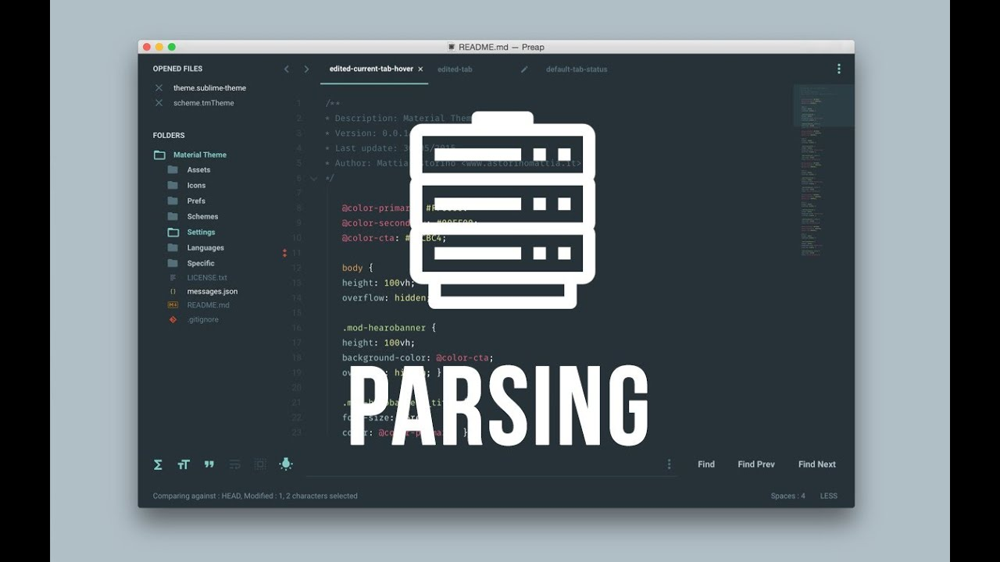
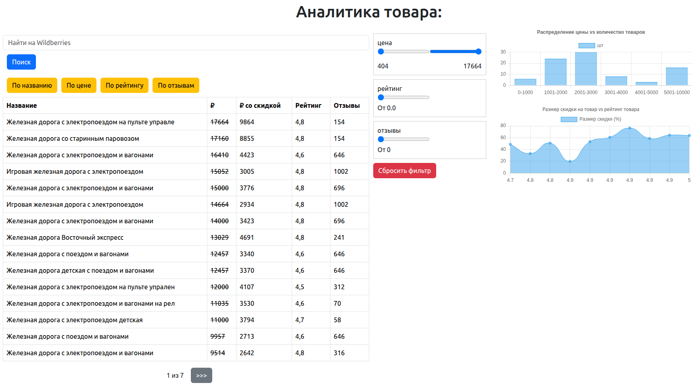

<div style="text-align: center">

</div>
<h1 style="text-align: center">Сервис аналитики товаров с визуализацией данных.</h1>

Краткое описание:

Сервис предназначен для анализа ассортимента товаров с 
возможностью фильтрации и сортировки данных, а также построения 
графиков для наглядного представления статистики.

1. Фильтрация
* Диапазон цен: Пользователь выбирает диапазон минимальной и максимальной стоимости товара.
* Минимальный рейтинг: Возможность фильтра по заданному значению рейтинга.
* Количество отзывов: Выбор минимального количества отзывов для отображаемых товаров.

2. Сортировка
Пользователь может сортировать таблицу по следующим критериям:
* По возрастанию / убыванию рейтинга
* По возрастанию / убыванию количества отзывов
* По возрастанию / убыванию цены
* По алфавиту названия товара

3. Графики и диаграммы
Для лучшего понимания характеристик товаров реализованы следующие типы графиков:
* Гистограмма распределения цен

Показывает распределение товаров по различным диапазонам цен. Это позволяет увидеть, насколько равномерно распределены продукты по категориям стоимостей.
* Линейный график размера скидок относительно рейтинга

График демонстрирует зависимость между размером скидки на товар и средним рейтингом. Таким образом можно выявить закономерность, влияет ли скидка на оценку товара пользователями.

---
* Особенности реализации
Все фильтры и графика динамически обновляют свою информацию при взаимодействии пользователя с интерфейсом, обеспечивая удобство и простоту восприятия данных.

---

### 
Для начальной настройки , Вам необходимо создать виртуальное окружение. 
Файл .env.template переименовать в .env, заполнить соответствующие параметры 

---

### 
Запуск через Docker-compose:
Открываем терминал, переходим в корневую папку с проектом:

1. Создаём образ командой ```docker compose build```
2. Поднимаем контейнер ```docker compose up```
3. В браузере переходим по адресу http://0.0.0.0/

### 

---

### 
Проверено линтерами (black, isort, flake8, mypy).

---

### 
Проект распространяется под лицензией MIT.

---